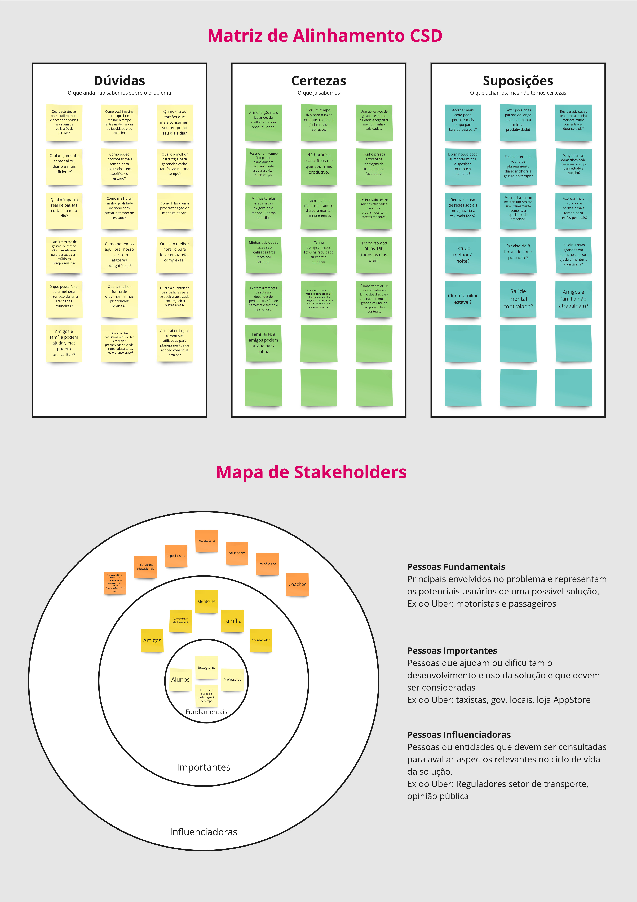
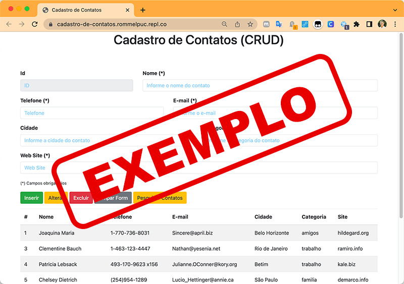

# Introdução

Informações básicas do projeto.

* **Projeto:** [NOME DO PROJETO]
* **Repositório GitHub:** [Link](https://github.com/ICEI-PUC-Minas-PPLCC-TI/ti-1-ppl-cc-m-2024-2-g5-dificuldade-em-otimizacao-do-tempo)
* **Membros da equipe:**

  * [Dalton Henrique](https://github.com/fulano)
  * [Leonardo Araújo Passos](https://github.com/LeoPassos98)
  * [Lucas do Amaral Rodrigues](https://github.com/LAR97)
  * [Marcos Vinícius Nunes Reis](https://github.com/marcosware)
  * [Maria Luíza Manini de Oliveira](https://github.com/malumanini)
  * [Vitor de Freitas Rios](https://github.com/Vitorfrios)

A documentação do projeto é estruturada da seguinte forma:

1. Introdução
2. Contexto
3. Product Discovery
4. Product Design
5. Metodologia
6. Solução
7. Referências Bibliográficas

✅ [Documentação de Design Thinking (MIRO)](files/processo-dt.pdf)

# Contexto

Muitas pessoas enfrentam dificuldades para otimizar o tempo devido à sobrecarga de tarefas, falta de planejamento e distrações. Isso pode causar atrasos na rotina e uma sensação de improdutividade, sendo essencial o uso de métodos para gerenciar e otimizar o tempo, priorizar atividades e alcançar um equilíbrio entre o trabalho e o lazer.

Nosso grupo visa criar uma plataforma online voltada para auxiliar os usuários a otimizar seu tempo, conectando-os a ferramentas e estratégias para melhorar sua produtividade. Reconhecemos que muitas pessoas enfrentam dificuldades para gerenciar suas tarefas diárias de maneira eficiente, o que pode aumentar o estresse e reduzir a qualidade de vida.


## Problema

**✳️✳️✳️ COLOQUE AQUI O SEU TEXTO ✳️✳️✳️**

> ⚠️ **APAGUE ESSA PARTE ANTES DE ENTREGAR SEU TRABALHO**
>
 * Dificuldade em gerenciar o tempo: Muitas pessoas enfrentam desafios para organizar suas tarefas e prioridades, levando a perda de produtividade e acúmulo de responsabilidades.
 * Impacto na qualidade de vida: A falta de estratégias eficazes para otimizar o tempo pode resultar em estresse, esgotamento e uma sensação constante de sobrecarga.
 * Dificuldade de acesso a ferramentas: Usuários podem ter dificuldade em encontrar métodos e recursos confiáveis para melhorar sua gestão do tempo de forma prática e acessível.
 * Sobrecarga de responsabilidades: O excesso de tarefas e a falta de organização resultam em longas listas de coisas a fazer, aumentando o tempo necessário para concluir atividades importantes.

## Objetivos

* Facilitar a otimização do tempo:
Nosso projeto visa criar uma plataforma online que ajuda os usuários a organizar e gerenciar melhor seu tempo, conectando-os a ferramentas e estratégias eficazes de produtividade.

* Promover um estilo de vida melhor:
A plataforma oferecerá uma maneira prática e acessível para os usuários identificarem suas prioridades, planejarem suas atividades e alcançarem um equilíbrio entre trabalho e vida pessoal.


## Justificativa

**✳️✳️✳️ COLOQUE AQUI O SEU TEXTO ✳️✳️✳️**

Impacto positivo na produtividade: Ao facilitar o acesso a ferramentas de gestão de tempo, podemos auxiliar os usuários a aumentar sua eficiência, reduzir o estresse e melhorar sua qualidade de vida.

Redução da procrastinação: De acordo com o artigo [A ciência da procrastinação](https://super.abril.com.br/comportamento/a-ciencia-da-procrastinacao), a procrastinação já é um problemma que afeta 20% dos adultos no Brasil. Com uma otimização de tempo, é possível reduzir a procrastinação e promover um estilo de vida mais produtivo, saudável e menos estressante.


## Público-Alvo

**✳️✳️✳️ COLOQUE AQUI O SEU TEXTO ✳️✳️✳️**

> ⚠️ **APAGUE ESSA PARTE ANTES DE ENTREGAR SEU TRABALHO**
>
> Descreva quais são as pessoas que usarão a sua aplicação indicando os diferentes perfis. A ideia é, dentro do possível, conhecer um pouco mais sobre o perfil dos usuários: conhecimentos prévios, relação com a tecnologia, relações hierárquicas, etc.
>
> Adicione informações sobre o público-alvo por meio de uma descrição textual, ou diagramas de personas, mapa de stakeholders, ou como o grupo achar mais conveniente.
>
> **Orientações**:
>
> - [Público-alvo: o que é, tipos, como definir seu público e exemplos](https://klickpages.com.br/blog/publico-alvo-o-que-e/)
> - [Qual a diferença entre público-alvo e persona?](https://rockcontent.com/blog/diferenca-publico-alvo-e-persona/)

# Product Discovery

## Etapa de Entendimento

* **Matriz CSD e Mapa de Stakeholders**




* **Entrevistas Qualitativas e **Highlights de Pesquisa**
  


## Etapa de Definição

### Personas

**✳️✳️✳️ APRESENTE OS DIAGRAMAS DE PERSONAS ✳️✳️✳️**

> ⚠️ **APAGUE ESSA PARTE ANTES DE ENTREGAR SEU TRABALHO**
>
> Relacione as personas identificadas no seu projeto e os respectivos mapas de empatia. Lembre-se que você deve ser enumerar e descrever precisamente e de forma personalizada todos os principais envolvidos com a solução almeja.
>
> **Orientações**:
>
> - [Persona x Público-alvo](https://flammo.com.br/blog/persona-e-publico-alvo-qual-a-diferenca/)
> - [O que é persona?](https://resultadosdigitais.com.br/blog/persona-o-que-e/)
> - [Rock Content](https://rockcontent.com/blog/personas/)
> - [Criar personas (Hotmart)](https://blog.hotmart.com/pt-br/como-criar-persona-negocio/)

# Product Design

Nesse momento, vamos transformar os insights e validações obtidos em soluções tangíveis e utilizáveis. Essa fase envolve a definição de uma proposta de valor, detalhando a prioridade de cada ideia e a consequente criação de wireframes, mockups e protótipos de alta fidelidade, que detalham a interface e a experiência do usuário.

## Histórias de Usuários

Com base na análise das personas foram identificadas as seguintes histórias de usuários:

| EU COMO...`PERSONA` | QUERO/PRECISO ...`FUNCIONALIDADE`        | PARA ...`MOTIVO/VALOR`               |
| --------------------- | ------------------------------------------ | -------------------------------------- |
| Estudante e Estagiário   | Gerenciar meu tempo | Equilibrar melhor meus estudos, trabalho e hobbies de jogos eletrônicos.             |
| Entusiasta de Jogos         | Conectar com outros desenvolvedores      | Compartilhar ideias e projetos |
|

> ⚠️ **APAGUE ESSA PARTE ANTES DE ENTREGAR SEU TRABALHO**
>
> Apresente aqui as histórias de usuário que são relevantes para o projeto de sua solução. As Histórias de Usuário consistem em uma ferramenta poderosa para a compreensão e elicitação dos requisitos funcionais e não funcionais da sua aplicação. Se possível, agrupe as histórias de usuário por contexto, para facilitar consultas recorrentes à essa parte do documento.
>
> **Orientações**:
>
> - [Histórias de usuários com exemplos e template](https://www.atlassian.com/br/agile/project-management/user-stories)
> - [Como escrever boas histórias de usuário (User Stories)](https://medium.com/vertice/como-escrever-boas-users-stories-hist%C3%B3rias-de-usu%C3%A1rios-b29c75043fac)

## Proposta de Valor

**✳️✳️✳️ APRESENTE O DIAGRAMA DA PROPOSTA DE VALOR PARA CADA PERSONA ✳️✳️✳️**

##### Proposta para Persona XPTO ⚠️ EXEMPLO ⚠️


> ⚠️ **APAGUE ESSA PARTE ANTES DE ENTREGAR SEU TRABALHO**
>
> O mapa da proposta de valor é uma ferramenta que nos ajuda a definir qual tipo de produto ou serviço melhor atende às personas definidas anteriormente.

## Requisitos

As tabelas que se seguem apresentam os requisitos funcionais e não funcionais que detalham o escopo do projeto.

### Requisitos Funcionais

| ID     | Descrição do Requisito                                   | Prioridade |
| ------ | ---------------------------------------------------------- | ---------- |
| RF-001 | Cadastro e login com e-mail, senha ou redes sociais | ALTA       |
| RF-002 | Gerenciar conclusão, nome, data e prioridade das tarefas | ALTA     |
| RF-003 | Mostrar tarefas no dashboard e cronograma | MÉDIA     |
| RF-004 | Sugerir otimizações no cronograma com base nas prioridades | MÉDIA     |
| RF-005 | Gerar relatórios e gráficos sobre tempo gasto e progresso | MÉDIA     |
| RF-006 | Alterar preferências do usuário, como notificações e tema | MÉDIA     |
| RF-007 | Enviar lembretes com notificações com diferenças de cores a partir da prioridade sobre o início das tarefas | MÉDIA     |
| RF-008 | Exibir o propósito do app e um slogan no topo | MÉDIA     |
| RF-009 | Formulário simples de cadastro com validação de campos | MÉDIA     |
| RF-010 | Dashboard com lista de tarefas, botão de nova tarefa e barra de navegação. | MÉDIA     |
| RF-011 | Formulário para criar nova tarefa com campos de nome, data/hora, prioridade | MÉDIA     |
| RF-012 | Página do cronograma para visualização e reordenação com tarefas organizadas por tempo | MÉDIA     |
| RF-013 | Página de progresso para exibir gráficos e estatísticas sobre tempo gasto e eficiência | MÉDIA     |
| RF-014 | Página de configurações para ajustar preferências de notificação e integração com calendários | MÉDIA     |
| RF-015 | Design responsivo e otimizado para diferentes dispositivos (desktop, tablet, smartphone) com layout dinâmico via CSS
 | MÉDIA     |
| RF-016 | Perfil do usuário com suas informações com opção de edição | MÉDIA     |
| RF-017 | Criar um pop-up temporário que aparece quando o usuário tenta excluir uma tarefa. | MÉDIA     |
| RF-018 | Página dedicada ao envio de feedback, com um formulário contendo campos de texto para categorizar o feedback | MÉDIA     |
| RF-019 | Implementar um campo de busca que permite ao usuário filtrar as tarefas por horário | MÉDIA     |
| RF-020 | Exibir um cronômetro de contagem regressiva para tarefas com prazo de conclusão | MÉDIA     |
| RF-021 | Implementar um temporizador que permite ao usuário usar a técnica Pomodoro | MÉDIA     |
| RF-022 | Implementar notificações automáticas via browser que aparecem quando uma tarefa está prestes a começar | MÉDIA     |
| RF-023 | Permitir que o usuário marque uma tarefa como "recorrente" (diária, semanal, mensal) e que ela seja automaticamente replicada no cronograma | MÉDIA     |
| RF-024 | Ícone para mostrar o email de contato para suporte caso ocorra algum bug | MÉDIA     |


### Requisitos não Funcionais

| ID      | Descrição do Requisito                                                              | Prioridade |
| ------- | ------------------------------------------------------------------------------------- | ---------- |
| RNF-001 | O sistema deve ser responsivo para rodar em um dispositivos móvel ⚠️ EXEMPLO ⚠️ | MÉDIA     |
| RNF-002 | Deve processar requisições do usuário em no máximo 3s ⚠️ EXEMPLO ⚠️          | BAIXA      |

> ⚠️ **APAGUE ESSA PARTE ANTES DE ENTREGAR SEU TRABALHO**
>
> Os requisitos de um projeto são classificados em dois grupos:
>
> - [Requisitos Funcionais (RF)](https://pt.wikipedia.org/wiki/Requisito_funcional):
>   correspondem a uma funcionalidade que deve estar presente na plataforma (ex: cadastro de usuário).
> - [Requisitos Não Funcionais (RNF)](https://pt.wikipedia.org/wiki/Requisito_n%C3%A3o_funcional):
>   correspondem a uma característica técnica, seja de usabilidade, desempenho, confiabilidade, segurança ou outro (ex: suporte a dispositivos iOS e Android).
>
> Lembre-se que cada requisito deve corresponder à uma e somente uma característica alvo da sua solução. Além disso, certifique-se de que todos os aspectos capturados nas Histórias de Usuário foram cobertos.
>
> **Orientações**:
>
> - [O que são Requisitos Funcionais e Requisitos Não Funcionais?](https://codificar.com.br/requisitos-funcionais-nao-funcionais/)
> - [O que são requisitos funcionais e requisitos não funcionais?](https://analisederequisitos.com.br/requisitos-funcionais-e-requisitos-nao-funcionais-o-que-sao/)

## Projeto de Interface

Artefatos relacionados com a interface e a interacão do usuário na proposta de solução.

### Wireframes

Estes são os protótipos de telas do sistema.

**✳️✳️✳️ COLOQUE AQUI OS PROTÓTIPOS DE TELAS COM TÍTULO E DESCRIÇÃO ✳️✳️✳️**

##### TELA XPTO ⚠️ EXEMPLO ⚠️

Descrição para a tela XPTO


> ⚠️ **APAGUE ESSA PARTE ANTES DE ENTREGAR SEU TRABALHO**
>
> Wireframes são protótipos das telas da aplicação usados em design de interface para sugerir a estrutura de um site web e seu relacionamentos entre suas páginas. Um wireframe web é uma ilustração semelhante ao layout de elementos fundamentais na interface.
>
> **Orientações**:
>
> - [Ferramentas de Wireframes](https://rockcontent.com/blog/wireframes/)
> - [Figma](https://www.figma.com/)
> - [Adobe XD](https://www.adobe.com/br/products/xd.html#scroll)
> - [MarvelApp](https://marvelapp.com/developers/documentation/tutorials/)

### User Flow

**✳️✳️✳️ COLOQUE AQUI O DIAGRAMA DE FLUXO DE TELAS ✳️✳️✳️**


> ⚠️ **APAGUE ESSA PARTE ANTES DE ENTREGAR SEU TRABALHO**
>
> Fluxo de usuário (User Flow) é uma técnica que permite ao desenvolvedor mapear todo fluxo de telas do site ou app. Essa técnica funciona para alinhar os caminhos e as possíveis ações que o usuário pode fazer junto com os membros de sua equipe.
>
> **Orientações**:
>
> - [User Flow: O Quê É e Como Fazer?](https://medium.com/7bits/fluxo-de-usu%C3%A1rio-user-flow-o-que-%C3%A9-como-fazer-79d965872534)
> - [User Flow vs Site Maps](http://designr.com.br/sitemap-e-user-flow-quais-as-diferencas-e-quando-usar-cada-um/)
> - [Top 25 User Flow Tools &amp; Templates for Smooth](https://www.mockplus.com/blog/post/user-flow-tools)

### Protótipo Interativo

**✳️✳️✳️ COLOQUE AQUI UM IFRAME COM SEU PROTÓTIPO INTERATIVO ✳️✳️✳️**

✅ [Protótipo Interativo (MarvelApp)](https://marvelapp.com/prototype/4hd6091?emb=1&iosapp=false&frameless=false)  ⚠️ EXEMPLO ⚠️

> ⚠️ **APAGUE ESSA PARTE ANTES DE ENTREGAR SEU TRABALHO**
>
> Um protótipo interativo apresenta o projeto de interfaces e permite ao usuário navegar pelas funcionalidades como se estivesse lidando com o software pronto. Utilize as mesmas ferramentas de construção de wireframes para montagem do seu protótipo interativo. Inclua o link para o protótipo interativo do projeto.

# Metodologia

Detalhes sobre a organização do grupo e o ferramental empregado.

## Ferramentas

Relação de ferramentas empregadas pelo grupo durante o projeto.

| Ambiente                    | Plataforma | Link de acesso                                     |
| --------------------------- | ---------- | -------------------------------------------------- |
| Processo de Design Thinking | Miro       | [PPLCC-M - G5 - Dificuldade em otimizar o tempo](https://miro.com/app/board/uXjVKn9kuFg=/)        |
| Repositório de código     | GitHub     | [ti-1-ppl-cc-m-2024-2-g5-dificuldade-em-otimizacao-do-tempo](https://github.com/ICEI-PUC-Minas-PPLCC-TI/ti-1-ppl-cc-m-2024-2-g5-dificuldade-em-otimizacao-do-tempo) |
| Hospedagem do site          | Render     | https://site.render.com/XXXXXXX ⚠️ EXEMPLO ⚠️ |
| Protótipo Interativo       | MarvelApp  | https://marvelapp.com/XXXXXXX ⚠️ EXEMPLO ⚠️   |
|                             |            |                                                    |

> ⚠️ **APAGUE ESSA PARTE ANTES DE ENTREGAR SEU TRABALHO**
>
> Liste as ferramentas empregadas no desenvolvimento do projeto, justificando a escolha delas, sempre que possível. Inclua itens como: (1) Editor de código, (2) )ferramentas de comunicação, (3) )ferramentas de diagramação, (4) )plataformas de hospedagem, entre outras.

## Gerenciamento do Projeto

Divisão de papéis no grupo e apresentação da estrutura da ferramenta de controle de tarefas (Kanban).


> ⚠️ **APAGUE ESSA PARTE ANTES DE ENTREGAR SEU TRABALHO**
>
> Nesta parte do documento, você deve apresentar  o processo de trabalho baseado nas metodologias ágeis, a divisão de papéis e tarefas, as ferramentas empregadas e como foi realizada a gestão de configuração do projeto via GitHub.
>
> Coloque detalhes sobre o processo de Design Thinking e a implementação do Framework Scrum seguido pelo grupo. O grupo poderá fazer uso de ferramentas on-line para acompanhar o andamento do projeto, a execução das tarefas e o status de desenvolvimento da solução.
>
> **Orientações**:
>
> - [Sobre Projects - GitHub Docs](https://docs.github.com/pt/issues/planning-and-tracking-with-projects/learning-about-projects/about-projects)
> - [Gestão de projetos com GitHub | balta.io](https://balta.io/blog/gestao-de-projetos-com-github)
> - [(460) GitHub Projects - YouTube](https://www.youtube.com/playlist?list=PLiO7XHcmTsldZR93nkTFmmWbCEVF_8F5H)
> - [11 Passos Essenciais para Implantar Scrum no seu Projeto](https://mindmaster.com.br/scrum-11-passos/)
> - [Scrum em 9 minutos](https://www.youtube.com/watch?v=XfvQWnRgxG0)

# Solução Implementada

Esta seção apresenta todos os detalhes da solução criada no projeto.

## Vídeo do Projeto

O vídeo a seguir traz uma apresentação do problema que a equipe está tratando e a proposta de solução. ⚠️ EXEMPLO ⚠️

[](https://www.youtube.com/embed/70gGoFyGeqQ)

> ⚠️ **APAGUE ESSA PARTE ANTES DE ENTREGAR SEU TRABALHO**
>
> O video de apresentação é voltado para que o público externo possa conhecer a solução. O formato é livre, sendo importante que seja apresentado o problema e a solução numa linguagem descomplicada e direta.
>
> Inclua um link para o vídeo do projeto.

## Funcionalidades

Esta seção apresenta as funcionalidades da solução.Info

##### Funcionalidade 1 - Cadastro de Contatos ⚠️ EXEMPLO ⚠️

Permite a inclusão, leitura, alteração e exclusão de contatos para o sistema

* **Estrutura de dados:** [Contatos](#ti_ed_contatos)
* **Instruções de acesso:**
  * Abra o site e efetue o login
  * Acesse o menu principal e escolha a opção Cadastros
  * Em seguida, escolha a opção Contatos
* **Tela da funcionalidade**:



> ⚠️ **APAGUE ESSA PARTE ANTES DE ENTREGAR SEU TRABALHO**
>
> Apresente cada uma das funcionalidades que a aplicação fornece tanto para os usuários quanto aos administradores da solução.
>
> Inclua, para cada funcionalidade, itens como: (1) titulos e descrição da funcionalidade; (2) Estrutura de dados associada; (3) o detalhe sobre as instruções de acesso e uso.

## Estruturas de Dados

Descrição das estruturas de dados utilizadas na solução com exemplos no formato JSON.Info

##### Estrutura de Dados - Contatos   ⚠️ EXEMPLO ⚠️

Contatos da aplicação

```json
  {
    "id": 1,
    "nome": "Leanne Graham",
    "cidade": "Belo Horizonte",
    "categoria": "amigos",
    "email": "Sincere@april.biz",
    "telefone": "1-770-736-8031",
    "website": "hildegard.org"
  }
  
```

##### Estrutura de Dados - Usuários  ⚠️ EXEMPLO ⚠️

Registro dos usuários do sistema utilizados para login e para o perfil do sistema

```json
  {
    id: "eed55b91-45be-4f2c-81bc-7686135503f9",
    email: "admin@abc.com",
    id: "eed55b91-45be-4f2c-81bc-7686135503f9",
    login: "admin",
    nome: "Administrador do Sistema",
    senha: "123"
  }
```

> ⚠️ **APAGUE ESSA PARTE ANTES DE ENTREGAR SEU TRABALHO**
>
> Apresente as estruturas de dados utilizadas na solução tanto para dados utilizados na essência da aplicação quanto outras estruturas que foram criadas para algum tipo de configuração
>
> Nomeie a estrutura, coloque uma descrição sucinta e apresente um exemplo em formato JSON.
>
> **Orientações:**
>
> * [JSON Introduction](https://www.w3schools.com/js/js_json_intro.asp)
> * [Trabalhando com JSON - Aprendendo desenvolvimento web | MDN](https://developer.mozilla.org/pt-BR/docs/Learn/JavaScript/Objects/JSON)

## Módulos e APIs

Esta seção apresenta os módulos e APIs utilizados na solução

**Images**:

* Unsplash - [https://unsplash.com/](https://unsplash.com/) ⚠️ EXEMPLO ⚠️

**Fonts:**

* Icons Font Face - [https://fontawesome.com/](https://fontawesome.com/) ⚠️ EXEMPLO ⚠️

**Scripts:**

* jQuery - [http://www.jquery.com/](http://www.jquery.com/) ⚠️ EXEMPLO ⚠️
* Bootstrap 4 - [http://getbootstrap.com/](http://getbootstrap.com/) ⚠️ EXEMPLO ⚠️

> ⚠️ **APAGUE ESSA PARTE ANTES DE ENTREGAR SEU TRABALHO**
>
> Apresente os módulos e APIs utilizados no desenvolvimento da solução. Inclua itens como: (1) Frameworks, bibliotecas, módulos, etc. utilizados no desenvolvimento da solução; (2) APIs utilizadas para acesso a dados, serviços, etc.

# Referências

As referências utilizadas no trabalho foram:

* SOBRENOME, Nome do autor. Título da obra. 8. ed. Cidade: Editora, 2000. 287 p ⚠️ EXEMPLO ⚠️

> ⚠️ **APAGUE ESSA PARTE ANTES DE ENTREGAR SEU TRABALHO**
>
> Inclua todas as referências (livros, artigos, sites, etc) utilizados no desenvolvimento do trabalho.
>
> **Orientações**:
>
> - [Formato ABNT](https://www.normastecnicas.com/abnt/trabalhos-academicos/referencias/)
> - [Referências Bibliográficas da ABNT](https://comunidade.rockcontent.com/referencia-bibliografica-abnt/)
